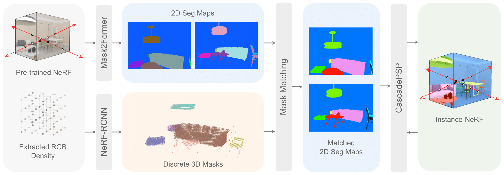

# Instance-NeRF
[](https://arxiv.org/abs/2304.04395) [](https://www.youtube.com/watch?v=wW9Bme73coI) [](#citation)

Instance Neural Radiance Field [Instance-NeRF, ICCV 2023].

This is the official PyTorch implementation of [Instance-NeRF](https://arxiv.org/abs/2304.04395).

> [**Instance Neural Radiacne Field**](https://arxiv.org/abs/2304.04395)           
> Yichen Liu*, Benran Hu*, Junkai Huang*, Yu-Wing Tai, Chi-Keung Tang           
> IEEE/CVF International Conference on Computer Vision (ICCV), 2023     
> *\* indicates equal contribution*


## Instance-NeRF Model Architecture



## Installation

First, clone this repo and the submodules.
```bash
git clone https://github.com/lyclyc52/Instance_NeRF.git --recursive
```

Ther are two submodules used in the repo:
- [RoIAlign.pytorch](https://github.com/zymk9/RoIAlign.pytorch/tree/b0fa4dbe45a21b2573275965bdeee1f0a3a9b326): It will be used in the NeRF-RCNN training. We adapt the 2D RoIAlign to 3D input.
- [torch-ngp](https://github.com/zymk9/torch-ngp/tree/instance_nerf): We modified torch-ngp to add instance field training.


To install Instance-NeRF:

1. Create a conda environment:
```bash
conda env create -f environment.yml
conda activate instance_nerf
```

2. Follow the instructions in [RoIAlign.PyTorch](https://github.com/zymk9/RoIAlign.pytorch/tree/b0fa4dbe45a21b2573275965bdeee1f0a3a9b326) and [torch-ngp](https://github.com/zymk9/torch-ngp/tree/instance_nerf) to compile the extensions and install related packages.


## Train Instance-NeRF
An overview of the entire training process:
1. Train NeRF models of the scenes and extract the RGB and density.
2. Train a NeRF-RCNN model using the extracted features and 3D annotations.
3. Perform inference on unseen NeRF scenes to get discrete 3D masks.
4. Run [Mask2Former](https://github.com/facebookresearch/Mask2Former) to get the initial 2D segmentation masks of the scenes. Use the 3D masks to match 2D masks.
5. Train an instance field with the masks aligned, and optionally refine the NeRF-produced masks with CascadePSP and repeat NeRF training.

For step 1-3, please refer to the documentation in [nerf_rcnn](nerf_rcnn/README.md).

For step 4-5, please check the docs in [instance_nerf](https://github.com/zymk9/torch-ngp/tree/instance_nerf#instance-field-training).


## Pre-trained Weights

### NeRF-RCNN 

You can download our pre-trained models (NeRF-RPN and NeRF-RCNN model) [here] TODO. 

To train from scratch, first you need to train a NeRF-RPN model. It is based on [NeRF-RPN](https://github.com/lyclyc52/NeRF_RPN/tree/main/nerf_rpn) and we disable the `--rotated_box` flag. 
We provide sample training and testing shell scripts called `train/test_rpn/rcnn.sh` for NeRF-RPN and NeRF-RCNN under [nerf_rcnn](./nerf_rcnn) folder, 


## Dataset
We extended the 3D-FRONT NeRF Dataset used in [NeRF-RPN](https://github.com/lyclyc52/NeRF_RPN) by increasing the number of scenes from ~250 to ~1k, adding instance labels for each object, as well as including 2D and 3D instance segmentation masks. We will soon upload the entire dataset.

Currently, only a subset of the dataset which contains the scenes for evaluation in the paper is available.

For training Instance-NeRF, as well as NeRF-RCNN on your custom datasets, please refer to both the [NeRF-RPN dataset creation](https://github.com/lyclyc52/NeRF_RPN/blob/main/data/README.md#nerf-rpn-dataset) and the [NeRF-RCNN training guide](https://github.com/hjk0918/NeRF_RCNN/tree/public_version/nerf_rcnn#nerf-rcnn-training).


### NeRF-RCNN Dataset Creation

We build our dataset based on [3D-FRONT](https://tianchi.aliyun.com/specials/promotion/alibaba-3d-scene-dataset).

If you want to know more details, you can refer to this forked [BlenderProc repo](https://github.com/hjk0918/BlenderProc/tree/main/scripts) for how we generate our data. For NeRF training and feature extraction, please check [this repo](https://github.com/zymk9/instant-ngp/tree/master/scripts). To predict RoIs, please check [NeRF-RPN](https://github.com/lyclyc52/NeRF_RPN/tree/main).

**Note**: The pre-trained NeRF-RPN model we published here is different from that in NeRF-RPN repo. In this paper, we use AABB bounding boxes and include more data in our training. 


## Citation
If you find Instance-NeRF useful in your research or refer to the provided baseline results, please star :star: this repository and consider citing :pencil::
```
@inproceedings{instancenerf,
    title = {Instance Neural Radiacne Field},
    author = {Liu, Yichen and Hu, Benran and Huang, Junkai and Tai, Yu-Wing and Tang, Chi-Keung},
    booktitle = {Proceedings of the IEEE/CVF International Conference on Computer Vision (ICCV)},
    year = {2023}
}
```
